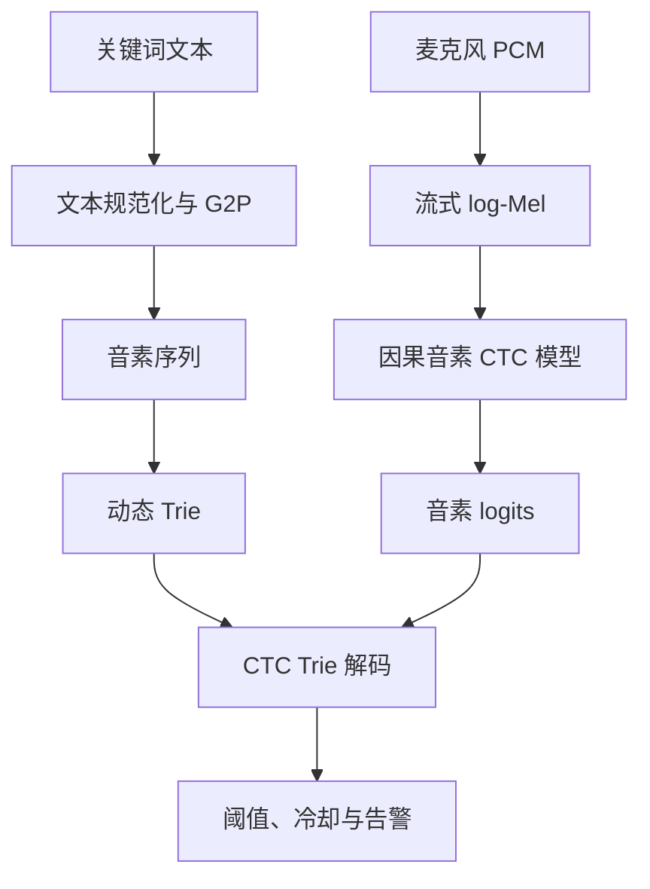
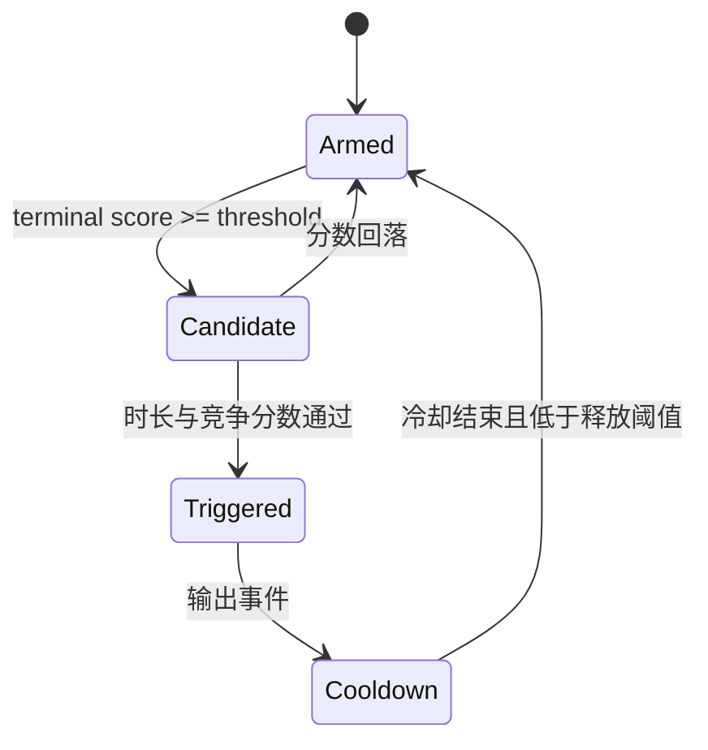

# 音素 CTC + 关键词 Trie 动态关键词识别方案

> 目标平台：openvela / NuttX，ESP32-S3，16 kHz 数字麦克风，TFLite Micro INT8
> 文档版本：0.1
> 日期：2026-08-03
> 状态：技术方案与实施基线，文中的资源和性能数字均为设计目标或估算，不能作为真机实测结果

## 1. 目标与结论

本方案实现完全离线的开放词表关键词识别（Open-vocabulary KWS）：用户在运行时输入中文文本或拼音，即可添加、删除和修改关键词，不需要重新训练或重新烧录神经网络模型。

核心不是继续扩大 `DS-CNN/BC-ResNet` 的分类输出，而是把系统拆成两个部分：

1. 通用中文音素声学模型：连续输出每一帧属于各音素和 CTC blank 的概率；
2. 动态关键词解码器：把关键词转换成音素序列，插入 Trie，通过流式 CTC 前缀搜索判断是否出现关键词。

整体链路：



该路线与 MultiNet 的“运行时添加命令”在产品形态上相似。ESP-SR 官方资料显示 MultiNet 支持运行时添加、删除、修改命令；sherpa-onnx 也把开放词表 KWS 实现为小型流式 ASR 加关键词搜索。[ESP-SR MultiNet](https://docs.espressif.com/projects/esp-sr/en/latest/esp32s3/speech_command_recognition/README.html)、[sherpa-onnx KWS](https://k2-fsa.github.io/sherpa/onnx/kws/index.html)

### 1.1 适用边界

适合：

- 用户需要现场增加几十至上百条中文命令；
- 更新关键词时不允许重新训练模型；
- 需要展示类似 MultiNet 的动态加词能力；
- 允许投入明显高于固定类别 KWS 的训练和误唤醒调优成本。

不适合：

- 产品始终只有“救命、帮助、报警”等 2–3 个固定关键词；
- RAM/Flash 极紧，并且误唤醒要求非常严；
- 没有足够的普通中文转写语料和长音频负样本。

对当前项目，建议保留已经训练的固定关键词模型作为安全词基线和回退路径，将动态模型作为独立运行模式：

```bash
audio_event --mode event             # 原事件分类，默认
audio_event --mode keyword-fixed     # 固定安全关键词
audio_event --mode keyword-dynamic   # 音素 CTC + Trie
```

在完成真机性能测量前，不建议把事件模型、固定 KWS 和动态 KWS 在同一个实时循环中串行运行。

## 2. 需求定义

### 2.1 功能需求

- 16 kHz 单声道 PCM 连续输入；
- 推理和解码完全在端侧进行；
- 支持运行时添加、删除、启停关键词；
- 每个关键词支持多个读音和独立阈值；
- 返回关键词 ID、ASCII/pinyin 标签、分数和触发时间；
- 支持概率平滑、释放阈值、冷却和重复抑制；
- 不因新增动态模式破坏原事件检测模式。

### 2.2 非功能需求

- 神经网络 full-int8，输入和输出均为 `int8`；
- 固件不依赖 TensorFlow 的 CTC decoder 算子；
- Trie 和 CTC 解码器使用 C 实现，TFLite Micro 推理封装使用 C++；
- 固件和训练端特征输入应逐元素一致；
- 所有数据、模型、词表、G2P 规则和量化参数均可追溯；
- 不把 PC 结果、理论 MAC 数或模拟结果写成 ESP32-S3 实测结果。

## 3. 关键设计决策

| 决策项 | 选择 | 原因 |
|---|---|---|
| 建模单位 | 声母 + 带声调韵母 | 输出词表较小，又保留中文声调区分能力 |
| 训练目标 | CTC | 不需要帧级音素对齐，适合“音频 + 句子转写”语料 |
| 主干网络 | 因果 DS-TCN | 算子简单、状态小、适合 INT8 和流式部署 |
| 搜索结构 | 关键词 Trie | 复杂度与活动关键词前缀相关，避免完整 ASR 搜索 |
| 固件解码 | 自研 CTC prefix/token passing | 不向 TFLite 模型引入解码和动态字符串算子 |
| G2P | PC/手机端生成音素，板端接收音素；后续再加板端小词典 | 先规避中文多音字和大词典占用 |
| 前端 | 复用 16 kHz、30 ms、20 ms、40-bin log-Mel | 降低移植风险，但必须做黄金输入对比 |
| 运行方式 | 独立动态关键词模式 | 避免未经测量的多模型实时串行运行 |

## 4. 中文音素体系

### 4.1 推荐 token 设计

推荐采用：

```text
声母 token + 带声调韵母 token
```

示例：

```text
救命  jiu4 ming4  → j iou4 m ing4
帮助  bang1 zhu4  → b ang1 zh u4
报警  bao4 jing3  → b ao4 j ing3
```

词表包括：

- 普通话声母；
- 带 1–5 声的韵母，5 表示轻声；
- `sil` 或可选的句间停顿标记；
- 可选的 `spn/noise` 标记；
- CTC `blank`。

最终 token 数由规范化规则和训练语料决定，预计为百级到约两百级，必须由脚本生成，不能在代码中手填类别数。

### 4.2 为什么不直接使用汉字

- 汉字词表通常达到数千；
- 小模型的输出层和训练难度增加；
- 未见词中的字和同音关系难以共享；
- 动态 KWS 真正需要的是发音匹配，而不是完整文字识别。

### 4.3 为什么不把声调完全丢弃

普通话同音、近音密度很高。丢弃声调虽然降低 token 数，却会增加关键词与普通对话的碰撞概率。第一版应保留声调，然后通过消融实验比较：

1. 声母 + 带声调韵母；
2. 声母 + 韵母 + 独立声调 token；
3. 不带声调音素。

### 4.4 G2P 与多音字

训练端可以使用 [pypinyin](https://github.com/mozillazg/python-pinyin) 生成初始拼音；它支持词组和自定义短语词典，但多音字结果仍必须检查。建议保存一份版本化的覆盖表：

```yaml
重启: [chong2, qi3]
银行: [yin2, hang2]
长按: [chang2, an4]
```

第一版运行时接口建议使用：

```text
显示文本 + 人工确认的数字声调拼音
```

例如：

```text
keyword add 101 "打开客厅灯" "da3 kai1 ke4 ting1 deng1"
```

这仍然属于动态加词，只是 G2P 在配置工具、手机或 PC 上完成。真正板端“只输入汉字”需要额外移植词典和多音字消歧，不应与声学模型开发绑在第一阶段。

### 4.5 CTC blank 不是 silence 类

`blank` 表示当前帧不输出新 token，用于对齐和合并重复标签；它不能简单解释为“静音类别”。纯背景音、无法转写的语音和噪声需要通过数据清洗、可选 `spn/noise` token、声学增强以及解码器中的 filler 路径处理。

CTC 能直接对未切分序列训练，不要求人工提供音素时间边界。[CTC 原始论文](https://www.cs.toronto.edu/~graves/icml_2006.pdf)

## 5. 数据集方案

数据分成四组：通用音素训练、噪声增强、动态关键词验证、连续流负样本。各组用途不能混淆。

### 5.1 通用中文转写语料

| 数据集 | 用途 | 优点 | 局限与许可注意 |
|---|---|---|---|
| AISHELL-1 | 第一版主训练集 | 约 178 小时、400 人、16 kHz、人工转写，规模适合快速迭代 | 环境偏安静；OpenSLR 页面表述为学术使用，论文表述 Apache 2.0，发布前应以下载包实际许可文件为准 |
| Common Voice zh-CN | 说话人和录音设备多样性 | 带文本和说话人标识，可按 `client_id` 分组 | 中文规模随版本变化；当前 Common Voice 条款使用 CC0，下载时记录具体版本 |
| WenetSpeech | 扩大多领域训练，适合教师模型或第二阶段 | 10,000+ 小时，多场景、播客和网络视频 | 官方网站注明非商业使用且原始音频版权仍归来源方；比赛研究可评估使用，商业产品不能仅凭“CC BY 4.0”字样下结论 |

官方来源：[AISHELL-1](https://www.openslr.org/33/)、[Common Voice](https://commonvoice.mozilla.org/en/terms)、[WenetSpeech](https://wenet-e2e.github.io/WenetSpeech/)

推荐分阶段使用：

- P0 管线验证：AISHELL-1 的 5–20 小时子集；
- P1 可用基线：完整 AISHELL-1 + Common Voice zh-CN；
- P2 鲁棒模型：再加入经过许可审核的 WenetSpeech 强标注子集；
- P3 蒸馏：使用更大的教师模型为全部训练数据生成软音素后验。

### 5.2 负样本和设备域数据

| 数据 | 用途 | 说明 |
|---|---|---|
| MobvoiHotwords 非关键词部分 | 智能音箱距离、电视、音乐和普通中文负样本 | 官方页面提供约 220 小时非关键词数据，Apache License |
| 项目原 cough/knock 数据 | 困难非语音负样本 | 必须保留原始录音 ID，避免重叠切片泄漏 |
| ESP32-S3 + INMP441 自采 | 麦克风频响、底噪、远场和房间混响 | 训练增强、量化校准和最终测试都要覆盖 |
| 普通中文长对话 | 误唤醒率测试 | 不能只切成短片段做分类准确率 |

[MobvoiHotwords 官方页面](https://www.openslr.org/87/)说明其包含约 220 小时来自同一智能音箱的非关键词数据。

### 5.3 噪声与混响增强

- [MUSAN](https://www.openslr.org/17/)：音乐、语音和噪声，CC BY 4.0；
- [Microsoft DNS Challenge](https://github.com/microsoft/DNS-Challenge)：噪声与混合脚本，仓库和数据涉及 MIT/CC BY 等不同来源，应逐项保存许可；
- 自采风扇、空调、电视、走廊、车辆和室内底噪；
- 自采房间脉冲响应，或使用明确许可的 RIR 数据。

### 5.4 动态关键词专用数据

关键词录音主要用于解码阈值校准和最终评估，不应把它们重新变成固定分类模型训练集。

建议至少建立两套词表：

```text
development_keywords
  用于开发解码器、调阈值和困难负样本挖掘

heldout_keywords
  训练和阈值开发阶段不可使用，只在最终测试时动态加入
```

目标词至少包括：

```text
jiu_ming  救命
bang_zhu  帮助
bao_jing  报警
```

为每个词采集：

- 多说话人、性别、年龄和口音；
- 正常、快速、慢速、低声和呼喊；
- 0.3 m、1 m、3 m；
- 安静、电视、音乐、风扇和室外噪声；
- 相似词和包含词，例如“究竟”“帮主”“抱紧”“报警器”“不要报警”。

“报警器”“不要报警”是否应触发必须由产品定义决定。音素 KWS 本身不能理解否定语义。

### 5.5 推荐数据目录

```text
datasets/
├── raw/
│   ├── aishell1/
│   ├── common_voice_zh_cn/
│   ├── wenetspeech_subset/
│   ├── mobvoi_hotwords/
│   ├── musan/
│   ├── dns_noise/
│   └── device_recordings/
├── manifests/
│   ├── train.jsonl
│   ├── dev.jsonl
│   ├── test.jsonl
│   ├── negative_streams.jsonl
│   └── licenses.csv
├── lexicon/
│   ├── tokens.txt
│   ├── phrases.dict.yaml
│   └── g2p_config.yaml
├── processed/
└── golden/
```

每条 manifest 至少包含：

```json
{
  "audio": "raw/aishell1/...wav",
  "duration_s": 3.42,
  "sample_rate": 16000,
  "text_raw": "请打开客厅灯",
  "text_norm": "请打开客厅灯",
  "pinyin": ["qing3", "da3", "kai1", "ke4", "ting1", "deng1"],
  "tokens": ["q", "ing3", "d", "a3", "k", "ai1", "k", "e4", "t", "ing1", "d", "eng1"],
  "speaker_id": "spk0001",
  "recording_id": "session0001",
  "source": "aishell1",
  "license": "VERIFY_FROM_SOURCE_PACKAGE"
}
```

### 5.6 数据划分规则

必须先按 `speaker_id + recording_id` 分组，再划分 train/dev/test，最后才切片或增强。

还需要两种额外隔离：

1. 关键词隔离：最终 held-out 关键词不参与解码阈值开发；
2. 长录音隔离：来自同一电视节目、播客或会话的片段只能出现在一个集合中。

“动态加词”不意味着组成该词的音素从未在训练中出现；真正要验证的是该词没有被作为固定类别或专门优化目标训练。若要做更严格实验，可以过滤训练转写中完整出现的 held-out 短语。

## 6. 音频与特征前端

### 6.1 第一版参数

| 参数 | 建议值 |
|---|---:|
| Sample rate | 16,000 Hz |
| PCM | mono, signed 16-bit |
| Window | 30 ms / 480 samples |
| Hop | 20 ms / 320 samples |
| FFT | 512 |
| Mel bins | 40 |
| 频率范围 | 由现有固件确定并写入 metadata |
| 特征 | log-Mel |
| 帧堆叠 | 2 帧，可选；25 次模型更新/秒 |

当前事件模型的 1 秒输入是固定分类窗口；CTC 训练应使用可变长度序列，例如 1–8 秒，流式推理则持续保存网络状态，不每 20 ms 重算整段 1 秒特征。

### 6.2 必须锁定的细节

- PCM 缩放方式；
- DC removal、pre-emphasis 是否启用；
- 窗函数和系数；
- FFT 补零和功率谱公式；
- Mel 标度、上下限和滤波器系数；
- `ln`、`log10` 或定点 log；
- 特征归一化；
- int8 scale、zero-point、舍入和饱和规则。

### 6.3 黄金特征测试

```text
固定 PCM
├── Python 前端 → float log-Mel → int8 输入
└── 固件/主机 C 前端 → float/定点 log-Mel → int8 输入
```

测试输出：

- shape 和帧顺序；
- 首个不一致元素；
- 不一致元素数量；
- `max_abs_diff`；
- 最终 int8 字节是否完全一致。

理想验收是完全一致；如定点近似只能做到 ±1 LSB，应明确记录原因、占比和对 logits 的影响。

## 7. 模型架构

### 7.1 推荐学生模型：Causal DS-TCN-CTC-S

输入形状：`[B, T, 40]`，其中 `T` 可变。

```text
40-bin log-Mel
→ FrameStack(2): 80 dims, 40 ms/update
→ Dense/Conv1x1: 80 → 48
→ DS-TCN Block × 6, dilation=[1,2,4,8,1,2]
→ Conv1x1: 48 → token_count
→ int8 logits
```

单个残差块：

```text
input 48ch
→ Pointwise Conv 48→96
→ BN + ReLU6
→ Causal Depthwise Conv1D(k=3, dilation=d)
→ BN + ReLU6
→ Pointwise Conv 96→48
→ BN
→ Add(input)
→ ReLU6
```

TFLite 中可将 Conv1D 表达为高度为 1 的 Conv2D/DepthwiseConv2D，训练导出时检查最终算子表。BatchNorm 在导出时折叠进卷积。

### 7.2 模型规格候选

| 规格 | 通道/扩展 | Block | dilation | 用途 |
|---|---|---:|---|---|
| S | 48/96 | 6 | 1,2,4,8,1,2 | MCU 首选起点 |
| M | 64/128 | 8 | 1,2,4,8,1,2,4,8 | 精度候选 |
| SVDF-S | 64–96 units | 4–6 | memory 8–16 | 对照实验 |

S 模型按上述结构粗略估计只有约数万至十万级权重、每秒数百万级 MAC，但这只是架构预算，不是导出模型大小、Tensor Arena 或 ESP32-S3 延迟实测。最终是否满足 128 KB Arena 必须以 `.tflite` 解析和真机日志为准。

Google 的 KWS Streaming 项目提供了流式层、SVDF、DS-TC-ResNet、训练到流式转换和量化参考，可借鉴其状态管理方式。[Google KWS Streaming](https://github.com/google-research/google-research/blob/master/kws_streaming/README.md)

### 7.3 感受野

帧堆叠后每次更新约 40 ms。`k=3`、dilation 为 `1,2,4,8,1,2` 时，理论时间感受野约为：

```text
1 + (k - 1) × sum(dilation)
= 1 + 2 × 18
= 37 个更新步
≈ 1.48 秒
```

这适合 2–6 音节的短命令。它是左上下文，不要求等待未来帧；实际触发仍可能需要末尾 blank 或释放条件。

### 7.4 流式状态

每个因果 depthwise 层只保存其需要的历史激活：

```text
state_frames = (kernel_size - 1) × dilation
```

状态由固件显式管理，建议模型接口采用：

```text
input_feature_chunk + input_state[]
→ logits + output_state[]
```

或者将 state 留在 TFLite Micro 封装内部。不要在每次调用中复制完整历史音频或完整 1 秒特征。

### 7.5 为什么不直接使用现有 BC-ResNet 分类头

可以复用其时序卷积思想，但必须修改：

- `GlobalAveragePool + 5 类 Dense` 改成逐时间步音素输出；
- 非因果卷积改成严格因果；
- 训练损失改成 CTC；
- 网络需要暴露或保存流式状态；
- 输出从关键词类别变成音素 token。

因此它不是简单“继续训练几轮”，而是保留骨干设计后重新训练新任务。

## 8. 训练流程

### 8.1 阶段 A：文本与词表准备

1. Unicode 和标点规范化；
2. 数字、单位和英文缩写按产品规则展开；
3. 汉字转数字声调拼音；
4. 使用短语词典修正多音字；
5. 拼音拆为声母和带声调韵母；
6. 从训练集生成稳定排序的 `tokens.txt`；
7. 冻结词表版本，dev/test 不允许生成新 token。

建议保留：

```text
normalizer_version
g2p_version
phrase_dictionary_hash
tokens_hash
```

### 8.2 阶段 B：数据过滤

- 丢弃损坏、削波严重和转写为空的音频；
- 过滤标签长度大于下采样后帧数的样本；
- 对超长录音按句子或时间戳切分；
- 检查音频时长与文字长度异常；
- 按 speaker/session 分组划分；
- 输出数据统计和许可清单。

### 8.3 阶段 C：数据增强

建议训练时随机启用：

| 增强 | 初始范围 |
|---|---|
| 音量 | -12 至 +6 dB |
| 速度 | 0.9、1.0、1.1 |
| 背景噪声 | SNR 0–20 dB，分层采样 |
| 音乐/电视 | SNR 0–15 dB |
| 房间混响 | 多房间、多 RT60 |
| 频响扰动 | 模拟不同麦克风和外壳 |
| SpecAugment | 小范围时间/频率遮挡，仅训练 |

低 SNR 样本不应占比过高，否则会损伤干净语音的音素边界学习。量化代表集使用真实特征分布，不应用 SpecAugment。

### 8.4 阶段 D：浮点 CTC 训练

训练目标：

```text
L = CTC(logits, phoneme_tokens)
```

可选加入教师蒸馏：

```text
L_total = L_ctc + λ × L_distill
```

建议初始超参数：

| 参数 | 起始值 |
|---|---|
| Optimizer | AdamW |
| Initial LR | 1e-3 |
| Weight decay | 1e-4 |
| Batch | 按总帧数动态分桶 |
| Epoch | 50–100，按 dev loss/PER 早停 |
| Gradient clip | 5.0 |
| Mixed precision | PC/GPU 训练可用 |

这些值是起点，不是最终结论。主模型选择依据不仅是 PER，还包括开放词表 KWS 的 FA/h 和 FRR。

### 8.5 阶段 E：蒸馏

如果 S 模型无法达到要求，建议先训练或选用较大的中文流式教师模型，再蒸馏学生：

- 教师生成每帧音素后验；
- 对齐教师和学生输出时间轴；
- 使用 KL divergence 或温度 soft target；
- CTC hard label 与 soft posterior 同时训练；
- 加入真实设备噪声域数据做后期蒸馏。

sherpa-onnx 提供的中文开放词表 KWS 模型使用拼音类建模单元，可作为 PC 端基线和分词设计参考，但不能假设其模型能直接放入 ESP32-S3。[sherpa-onnx 预训练 KWS 模型](https://k2-fsa.org/models/kws/)

### 8.6 阶段 F：量化

顺序建议：

1. FP32 基线；
2. full-int8 PTQ；
3. 若音素后验或 KWS 指标明显下降，再进行 QAT；
4. 导出前后逐层检查 logits 和流式状态。

full-int8 代表数据至少覆盖：

- 干净普通话；
- 强弱音量；
- 近场/远场；
- 噪声和音乐；
- 静音和设备底噪；
- 目标关键词与音近词。

TensorFlow 官方说明 full integer 量化需要 representative dataset 来校准权重和激活范围。[TensorFlow Lite 量化文档](https://www.tensorflow.org/model_optimization/guide/quantization/post_training)

### 8.7 建议训练命令接口

以下是拟实现的工程接口，不表示脚本已经存在：

```bash
python tools/prepare_manifest.py \
  --config configs/data_zh.yaml \
  --output datasets/manifests

python tools/build_lexicon.py \
  --manifests datasets/manifests/train.jsonl \
  --g2p-config configs/g2p_zh.yaml \
  --output artifacts/lexicon

python train_ctc.py \
  --config configs/ds_tcn_ctc_s.yaml \
  --train datasets/manifests/train.jsonl \
  --dev datasets/manifests/dev.jsonl \
  --output runs/ds_tcn_ctc_s

python evaluate_kws.py \
  --model runs/ds_tcn_ctc_s/best_saved_model \
  --keywords configs/keywords_dev.yaml \
  --positive-manifest datasets/manifests/kws_dev.jsonl \
  --negative-manifest datasets/manifests/negative_streams.jsonl

python export_tflite.py \
  --saved-model runs/ds_tcn_ctc_s/best_saved_model \
  --representative-manifest datasets/manifests/quant_calibration.jsonl \
  --full-int8 \
  --output artifacts/ds_tcn_ctc_s_int8
```

## 9. 关键词 Trie 与 CTC 解码器

### 9.1 关键词配置

```yaml
keywords:
  - id: 1
    name: jiu_ming
    display: 救命
    pronunciations:
      - [j, iou4, m, ing4]
    trigger_threshold: null
    release_threshold: null
    cooldown_ms: 2000

  - id: 2
    name: bang_zhu
    display: 帮助
    pronunciations:
      - [b, ang1, zh, u4]
    trigger_threshold: null
    release_threshold: null
    cooldown_ms: 2000
```

阈值初始应为 `null/待校准`，不能凭经验直接把 0.8 写成验证后的默认值。

### 9.2 Trie 节点

```c
typedef struct kws_trie_node_s
{
  uint16_t token_id;
  uint16_t first_child;
  uint16_t next_sibling;
  int16_t keyword_id;
  int16_t threshold_q;
} kws_trie_node_t;
```

使用数组索引而不是指针，便于静态分配、序列化和检查内存边界。关键词变化时只更新 Trie，不修改模型。

### 9.3 CTC 活动状态

每个活动前缀至少保存：

```c
typedef struct kws_ctc_state_s
{
  uint16_t node_index;
  int16_t p_blank_q;
  int16_t p_nonblank_q;
  uint32_t start_frame;
  uint16_t last_token;
} kws_ctc_state_t;
```

实际实现建议使用定点 log probability 或查表近似 `logsumexp`，先在主机端以 float 实现正确版本，再定点化。必须正确处理 CTC 的重复 token 规则：连续两个相同 token 若要表示两次，需要中间存在 blank。

### 9.4 每帧解码流程

1. 对 int8 logits 做 top-K 或阈值筛选；
2. 根节点在每一帧都允许启动新关键词；
3. blank 更新当前前缀的 `p_blank`；
4. 与 Trie 子节点匹配的 token 扩展前缀；
5. 合并到达同一 Trie 节点的路径；
6. 删除低于 best score 减 beam 的状态；
7. 到达终止节点后计算关键词分数；
8. 通过阈值、持续时间和冷却状态机后触发。

为了避免把“模型对任何语音都很自信”当成关键词，建议使用相对分数：

```text
keyword_score = normalized_logP(keyword_path)
                - α × normalized_logP(filler/background)
```

其中长度归一化、`α`、beam、top-K 和每词阈值全部通过连续流 dev 数据选择。

### 9.5 多发音和混淆词

一个关键词可以插入多条发音路径：

```text
空调 → kong1 tiao2
空调 → kong1 diao4   # 若产品确实要容忍该读法
```

但不能无节制添加宽松发音，否则误唤醒会显著增加。音近词应进入困难负样本集，而不是一律作为目标词别名。

### 9.6 事件状态机

推荐状态：



对短中文词不应机械要求“连续两次窗口命中”。CTC 已经积累完整音素路径，应根据终止路径分数、发音持续时间和释放条件触发。

## 10. openvela / NuttX 集成

### 10.1 模块边界

| 模块 | 语言 | 职责 |
|---|---|---|
| `audio_capture` | C | I2S、DMA、环形缓冲和溢出处理 |
| `audio_frontend` | C/C++ | PCM 到 int8 log-Mel |
| `phoneme_ctc_engine` | C++ + C API | TFLite Micro 初始化、状态和 logits |
| `kws_trie` | C | 动态关键词存储 |
| `ctc_keyword_decoder` | C | 前缀状态、剪枝、终止分数 |
| `kws_policy` | C | 阈值、冷却、重复抑制 |
| `audio_event_cli` | C | 模式和关键词管理命令 |
| `alert_output` | C | OLED、LED、蜂鸣器和串口 |

### 10.2 C/C++ API

```c
typedef struct
{
  int keyword_id;
  int16_t score_q15;
  uint32_t start_ms;
  uint32_t end_ms;
  bool triggered;
} ovkws_result_t;

int ovkws_engine_init(const ovkws_config_t *config);
int ovkws_add_keyword(int keyword_id,
                      const char *ascii_name,
                      const uint16_t *tokens,
                      size_t token_count,
                      const ovkws_policy_t *policy);
int ovkws_remove_keyword(int keyword_id);
int ovkws_process_features(const int8_t *frames,
                           size_t frame_count,
                           ovkws_result_t *result);
void ovkws_reset_stream(void);
void ovkws_engine_deinit(void);
```

### 10.3 任务调度

建议模型每 2 个 Mel 帧更新一次，即约 40 ms 一个 chunk：

```text
I2S/DMA → PCM ring → frontend → feature queue → CTC engine → Trie decoder
```

要求：

- 队列满时记录 drop 计数；
- 音频断流或时间戳跳变时重置模型 state 和 decoder；
- 每个 chunk 记录可选的特征、推理和解码耗时；
- 不在音频高优先级任务中更新 Trie 或执行 G2P；
- 更新关键词时使用双缓冲或短临界区原子切换 Trie。

### 10.4 内存布局建议

优先放内部 RAM：

- TFLite Tensor Arena；
- 当前输入和 logits；
- 卷积流式 state；
- 活动 CTC 状态。

可以放 PSRAM：

- 大 PCM 环形缓冲；
- 非实时关键词配置文本；
- 调试特征和日志缓存。

Trie 通常不大，可以内部 RAM 静态分配。需要设硬限制：

```text
CONFIG_OVKWS_MAX_KEYWORDS
CONFIG_OVKWS_MAX_TOKENS_PER_KEYWORD
CONFIG_OVKWS_MAX_TRIE_NODES
CONFIG_OVKWS_MAX_ACTIVE_STATES
```

### 10.5 构建配置建议

```text
CONFIG_AUDIO_EVENT_MODE_DEFAULT_EVENT=y
CONFIG_AUDIO_EVENT_KWS_DYNAMIC=y
CONFIG_OVKWS_MODEL_DS_TCN_S=y
CONFIG_OVKWS_MAX_KEYWORDS=64
CONFIG_OVKWS_MAX_TOKENS_PER_KEYWORD=24
CONFIG_OVKWS_MAX_ACTIVE_STATES=128
CONFIG_OVKWS_TENSOR_ARENA_SIZE=<实测后填写>
CONFIG_OVKWS_PROFILE=y
```

不要先把 Arena 写死为 128 KB 再删算子迎合数字；应由 `RecordingMicroInterpreter` 或等价内存记录输出实际持久区、临时区和各 tensor 用量。

## 11. 测试与评价

### 11.1 声学模型指标

- 音素错误率 PER；
- 带声调/不带声调 PER；
- clean/noisy/far-field 分组 PER；
- FP32 与 INT8 的 logits 差异；
- 流式与非流式输出一致性。

PER 只用于定位声学问题，不能代替 KWS 指标。

### 11.2 动态 KWS 指标

- 每个关键词 recall / FRR；
- precision 和混淆词分布；
- 每小时误唤醒数 FA/h；
- 从关键词结束到触发的 p50/p95 延迟；
- 重复触发率；
- 未见说话人、距离、噪声、音量和语速分组结果；
- held-out 关键词动态加入后的结果。

阈值选择建议：先给定目标 FA/h，再在 dev 集上最大化 recall，而不是选择普通分类 accuracy 最高的点。

### 11.3 连续流测试集

至少覆盖：

- 普通中文对话；
- 电视、广播、短视频和带歌词音乐；
- 咳嗽、敲门、狗叫等原事件类别；
- 目标词音近词；
- 包含目标词的长句；
- 长时间纯背景和设备底噪。

开发阶段可先使用不少于 10 小时负样本筛选明显问题；最终报告建议扩展到 100 小时量级。这里是评估规模建议，不是已完成数据。

### 11.4 板端资源指标

- `.tflite` 和 C 数组 Flash；
- token 表和 Trie Flash/RAM；
- Tensor Arena 实际峰值；
- 模型 state 和 decoder state RAM；
- 特征提取、模型、解码的单 chunk耗时；
- Feed/Fetch CPU usage；
- 实时系数和丢帧数；
- 端到端触发延迟；
- 如赛题要求，再测平均和峰值功耗。

### 11.5 回归测试

建议至少保存三类黄金用例：

```text
golden/
├── feature/       # PCM 与预期 int8 特征
├── logits/        # 特征与预期 token logits
└── streams/       # 连续音频与预期关键词事件列表
```

要求主机和板端均能从固定 PCM/WAV 运行，并输出可比较的时间戳、关键词 ID 和分数。

## 12. 训练与发布产物

```text
artifacts/ovkws_<timestamp>/
├── model_fp32_savedmodel/
├── model_int8.tflite
├── model_data.cc
├── model_data.h
├── tokens.txt
├── g2p_config.yaml
├── phrases.dict.yaml
├── frontend_metadata.json
├── model_metadata.json
├── train_config.yaml
├── dataset_split.json
├── dataset_licenses.csv
├── quantization.json
├── acoustic_evaluation.json
├── kws_evaluation.json
├── threshold_config.yaml
└── golden/
```

`model_metadata.json` 至少记录：

- 模型输入/输出 shape 和 dtype；
- sample rate、window、hop、FFT、Mel 参数；
- input/output scale 和 zero-point；
- token 顺序和 blank ID；
- 网络通道、block、dilation 和感受野；
- state tensor 的 shape 与量化参数；
- 训练代码版本、数据清单 hash；
- TFLite 算子列表。

## 13. 推荐实施阶段

### P0：数据和特征闭环

- 建立 manifest、G2P、token 生成；
- 使用小数据验证 CTC loss 能下降；
- 完成 Python/C 黄金特征逐元素对比。

通过条件：同一 PCM 的最终 int8 输入达到约定误差，词表和数据划分可复现。

### P1：PC 开放词表原型

- 训练浮点 DS-TCN-CTC-S；
- 实现 float CTC Trie 解码；
- 动态加入开发词和 held-out 词；
- 使用长负样本测 FA/h。

通过条件：证明“新增关键词不重新训练模型”，并能输出逐词阈值曲线。

### P2：小模型和量化

- 比较 DS-TCN-S、DS-TCN-M 和 SVDF-S；
- 进行蒸馏；
- full-int8 PTQ/QAT；
- 比较 FP32/INT8 的 PER、FRR 和 FA/h。

### P3：openvela 移植

- C++ 推理封装与 C 解码器；
- Kconfig/CMake/Make.defs；
- 固定 PCM 回归入口；
- keyword-dynamic 独立模式。

### P4：板端测量和优化

- 实测 Tensor Arena、RAM、Flash、chunk 耗时；
- 限制 active states、top-K 和 beam；
- 评估是否需要 PSRAM；
- 依据连续流数据校准每词阈值。

### P5：与原系统集成验证

- 原 event 模式构建、烧录和演示回归；
- 固定 KWS 与动态 KWS 对照；
- 不同模式连续运行和异常恢复；
- 输出复赛增量文档与真实测量结果。

## 14. 主要风险与应对

| 风险 | 影响 | 应对 |
|---|---|---|
| 两音节短词在普通对话中碰撞 | FA/h 高 | 保留声调、相对 filler 分数、音近词挖掘、逐词阈值 |
| 多音字 G2P 错误 | 关键词永远匹配不到 | 用户确认拼音、短语覆盖词典、多发音受控配置 |
| CTC blank 被误作静音 | 解码逻辑错误 | 独立处理 blank、noise 和 filler |
| 训练/固件特征不一致 | PC 准确、板端失效 | 固定 PCM 逐元素黄金测试 |
| 量化改变 token 排序和峰值 | INT8 误唤醒上升 | 代表集覆盖真实域，必要时 QAT，比较 logits 和 KWS 曲线 |
| 模型虽小但 Arena 超限 | 无法在 128 KB 内运行 | 先解析实际 Arena；减通道/chunk；保持状态显式；必要时使用 PSRAM |
| 数据泄漏 | 指标虚高 | speaker、session、原始长录音和关键词四层隔离 |
| 数据许可不清 | 无法发布模型 | 每个源保存版本、URL、license 文件和 NOTICE；WenetSpeech 单独审核 |
| 命令数量过多 | Trie 和 active states 失控 | Kconfig 上限、构建时校验、运行时拒绝超限 |
| VAD 漏掉低声呼救 | 安全词漏检 | 固定安全 KWS 不依赖强 VAD 门控；动态命令可在唤醒后运行 |

## 15. 最终推荐

第一版不要追求“板端直接输入任意汉字并识别”。应先完成下面这个可验证闭环：

```text
PC/手机输入汉字并确认拼音
→ 下发音素 token
→ ESP32-S3 动态更新 Trie
→ 因果 DS-TCN 输出音素 logits
→ CTC Trie 检测关键词
→ OLED/串口告警
```

首个模型使用 `DS-TCN-CTC-S`，数据使用 AISHELL-1 建立基线，再加入 Common Voice、自采 INMP441 数据、MobvoiHotwords 负样本和 MUSAN/DNS 噪声。先在 PC 上用 held-out 关键词证明动态加词和连续流误唤醒能力，再进行蒸馏、full-int8 和 openvela 移植。

固定的“救命、帮助、报警”仍建议保留专用 BC-ResNet/DS-CNN 模型作为安全路径；动态 CTC 模型承担用户自定义命令。两者的价值不同，不应仅用短片段准确率决定取舍。

## 16. 参考资料

- [ESP-SR MultiNet 官方文档](https://docs.espressif.com/projects/esp-sr/en/latest/esp32s3/speech_command_recognition/README.html)
- [sherpa-onnx Open-vocabulary KWS](https://k2-fsa.github.io/sherpa/onnx/kws/index.html)
- [sherpa-onnx 中文 KWS 模型](https://k2-fsa.org/models/kws/)
- [Google Research KWS Streaming](https://github.com/google-research/google-research/blob/master/kws_streaming/README.md)
- [Connectionist Temporal Classification](https://www.cs.toronto.edu/~graves/icml_2006.pdf)
- [AISHELL-1 / OpenSLR 33](https://www.openslr.org/33/)
- [WenetSpeech](https://wenet-e2e.github.io/WenetSpeech/)
- [Common Voice 使用条款](https://commonvoice.mozilla.org/en/terms)
- [MobvoiHotwords / OpenSLR 87](https://www.openslr.org/87/)
- [MUSAN / OpenSLR 17](https://www.openslr.org/17/)
- [Microsoft DNS Challenge](https://github.com/microsoft/DNS-Challenge)
- [TensorFlow Lite full-integer quantization](https://www.tensorflow.org/model_optimization/guide/quantization/post_training)
- [pypinyin](https://github.com/mozillazg/python-pinyin)
